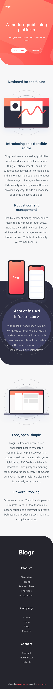
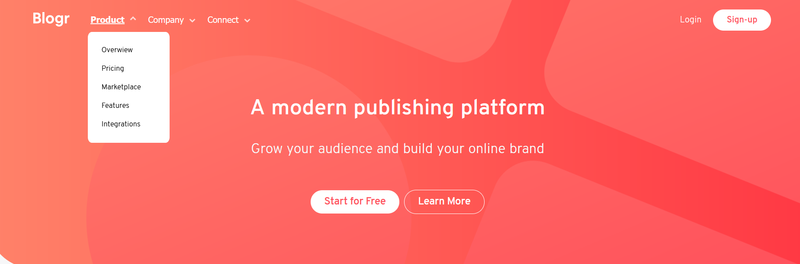
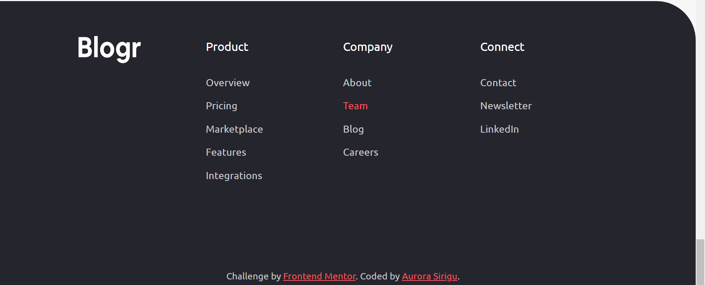

# Frontend Mentor - Blogr landing page solution

This is a solution to the [Blogr landing page challenge on Frontend Mentor](https://www.frontendmentor.io/challenges/blogr-landing-page-EX2RLAApP). Frontend Mentor challenges help you improve your coding skills by building realistic projects. 

## Table of contents

- [Overview](#overview)
  - [The challenge](#the-challenge)
  - [Screenshot](#screenshot)
  - [Links](#links)
- [My process](#my-process)
  - [Built with](#built-with)
  - [What I learned](#what-i-learned)
  - [Continued development](#continued-development)

## Overview

### The challenge

Users should be able to:

- View the optimal layout for the site depending on their device's screen size
- See hover states for all interactive elements on the page

### Screenshot

  Mobile (375px) layout
  

  Desktop (1440px) layout
  
  
  Desktop hover button 1
  

  Desktop hover button 2
  
  
  Desktop hover button 3
  
  
  Desktop hover menu
  
  
  Footer hover link
  
  
  Mobile navbar
  
  
  Mobile fixed navbar 1
  
  
  Mobile fixed navbar 2
  
  
  Mobile submenu
  

### Links

- Solution URL: (https://github.com/Auro-93/Landing-Page-Blogr---Frontend-Mentor-challenge.git)

## My process

### Built with

- Semantic HTML5 markup
- CSS custom properties
- Flexbox
- Mobile-first workflow
- SCSS
- Vanilla Javascript plus a bit of Jquery

### What I learned

Since I am a beginner in Web Development and IT in general, this project helped me to practice with basic tools for layouts and styles (Flexbox, svg, gradients) and interactivity (animations and responsive navbars with Javascript).

It was also a good opportunity to experiment, for the first time, with a bit of more structured stylization, in particular with Sass.

### Continued development

The goal of my next projects will be to move further and further away from the "spaghetti-code" and make my code more structured and maintainable.

